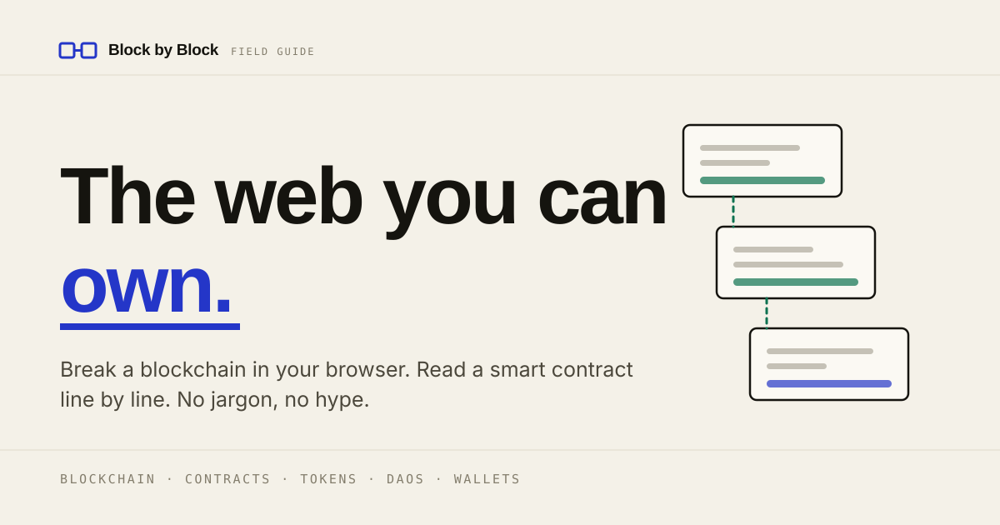

# Block by Block — a field guide to Web3

A responsive, dependency-free landing page that explains the decentralised web to
people who have never touched it: what a blockchain actually *is*, what a smart
contract actually *does*, which of the famous claims are true, and which are not.

Built for the Track A challenge, with the optional wallet bonus implemented.



**Live:** [shreya-anandhun.github.io/block-by-block](https://shreya-anandhun.github.io/block-by-block/) (GitHub Pages, deployed from the `version_1` branch) · **Stack:** hand-written HTML, CSS and
vanilla JavaScript. No frameworks, no build step, no dependencies, no trackers.

---

## Why this page exists@

Most Web3 explainers do one of two things: they sell, or they sneer. This one
tries to *teach* — and the central idea is that you should not have to take any
of it on faith. So the page does not draw a picture of a blockchain and call it
an explanation. It gives you four real blocks, hashes them in your browser, and
invites you to break them.

Three principles shaped it:

1. **Show, don't assert.** The proof-of-work demo is a working chain, not an
   animation. The contract is real, deployable Solidity, annotated line by line.
2. **Be honest about the trade-offs.** Every section names a cost — slower,
   costlier, irreversible, permanently public. A "Reality check" box closes the
   first section by pointing out that this page itself is plain Web2 HTML.
3. **Teach the safety rules early.** The wallet section spends more words on not
   getting robbed than on the connection itself.

---

## Web3 concepts covered

| Concept | Where | What the page says about it |
| --- | --- | --- |
| **Web1 / Web2 / Web3** | §01 The shift | Read → read-write → read-write-**own**. Each era framed by one question: who holds the database? |
| **Blockchain & hashing** | §02 Break a chain | A block's SHA-256 fingerprint, the stored previous hash that turns a list into a chain, and the tamper-evidence that falls out of it. |
| **Proof of work / mining / nonce** | §02 Break a chain | A nonce search for a hash with *n* leading zeros, with adjustable difficulty so the ~16× cost per extra zero is something you feel. |
| **Decentralisation** | §03 Concepts | Thousands of independent nodes, each holding a full copy and checking every rule — and the redundancy that costs. |
| **Consensus: PoW vs PoS** | §03 Concepts | Spending electricity versus bonding slashable capital. Ethereum's move to proof of stake in September 2022. |
| **Smart contracts** | §03, §04 | Programs deployed to an address, executed identically by every node, immutable once deployed. |
| **Tokens, ERC-20, NFTs (ERC-721)** | §03 Concepts | A token is a balance in a contract's ledger; an NFT is the row that says address X owns item #7 — not the image. |
| **DAOs & governance** | §03 Concepts | On-chain treasuries and token-weighted voting, plus whale control and voter apathy. |
| **Wallets, keys, seed phrases** | §03, §06 | A wallet holds keys, not coins. The recovery phrase *is* the money. |
| **Layer 2 / rollups** | §03 Concepts | Batching transactions off-chain and posting proofs back to Ethereum. |
| **Oracles** | §03 Concepts | Contracts cannot see the outside world; whoever feeds the oracle becomes a point of trust. |
| **Stablecoins** | §03 Concepts | Pegged tokens, and the reserve-holding company that quietly reintroduces a trusted third party. |
| **Gas, gwei, `require`, events, `msg.sender`, reverts** | §04 Contracts | Nine annotations on a working `TipJar` contract, including why modern Solidity sends ETH with `.call` rather than `.transfer`. |
| **Pseudonymity, energy, NFT ownership, "code is law", decentralisation theatre** | §05 Myths | Six flip cards separating the common claim from what is actually true. |
| **Address, EVM, node/RPC, mempool & front-running, finality, testnet, bridge, rug pull** | §07 Glossary | Ten terms defined in plain language, each with the catch attached. |

---

## The interactive pieces

### The proof-of-work chain (§02)

Four blocks are hashed live. Each stores the previous block's hash, so the chain
behaves exactly like the real thing:

- **Mine** searches nonces until the hash starts with *n* zeros. Difficulty is a
  slider from 1 to 5 — at 5 the search takes roughly a million hashes, which is
  the point.
- **Edit any block's data** and that block and every block after it turn red.
  Rewriting history means re-mining all of it.
- **Mine all blocks** cascades through the chain, which is precisely the work an
  attacker would have to redo faster than the network adds new blocks.

Hashing uses a small synchronous SHA-256 written for this project
([`js/sha256.js`](js/sha256.js)) rather than `crypto.subtle`, for two reasons:
`crypto.subtle` is asynchronous, and it is unavailable outside a secure context —
so it silently fails when someone opens `index.html` from disk. The
implementation is verified against the FIPS 180-4 test vectors and runs at
roughly 270,000 hashes per second, and mining is sliced across
`requestAnimationFrame` so the page never freezes.

### The annotated contract (§04)

A 26-line `TipJar` contract. Selecting a highlighted line swaps in an explanation
of what that line really does — version pragmas, `immutable`, mappings as
storage, events as receipts, `msg.sender`, `payable`, reverts, manual access
control, and the `.call` / `.transfer` distinction.

### Wallet connection (§06 — the optional bonus)

Implemented directly against **[EIP-1193](https://eips.ethereum.org/EIPS/eip-1193)**
with no library:

- **[EIP-6963](https://eips.ethereum.org/EIPS/eip-6963) discovery.** Rather than
  grabbing `window.ethereum` and hoping, the page listens for provider
  announcements. If several wallets are installed it shows a chooser;
  `window.ethereum` remains a fallback for older wallets.
- **Reads only.** `eth_requestAccounts`, `eth_chainId` and `eth_getBalance`.
  The page never requests a signature, a transaction or a token approval.
- **Live state.** `accountsChanged` and `chainChanged` are handled, so switching
  account or network in MetaMask updates the panel without a reload.
- **Real error paths.** User rejection (`4001`), an already-pending request
  (`-32002`), no wallet installed, and an unreachable RPC each get their own
  honest message.
- **Balance maths in `BigInt`**, because 18-decimal wei does not survive a
  `Number`.
- **A deterministic identicon** drawn from the address bytes — a mirrored 5×5
  grid, the same idea wallets use for their avatars.
- **Disconnect** clears local state and attempts `wallet_revokePermissions`,
  while telling the truth: the permission lives in your wallet, not on this page.

The section degrades cleanly with no wallet installed — it explains what would
have happened and links to MetaMask. Nothing else on the page depends on it.

---

## Design

An "ink on paper" field-guide aesthetic, chosen deliberately to avoid the purple
gradients and glassmorphism that every Web3 template arrives with. Warm paper
ground, near-black ink, one structural blue and one signal orange, with
monospace reserved for data — hashes, addresses, labels, code.

- **Design tokens.** Every colour, space, duration and type step is a custom
  property in [`css/base.css`](css/base.css). Dark mode is a complete
  re-declaration of the same token names, so no component knows which theme is
  active. The choice persists in `localStorage` and is applied before first
  paint, so the page never flashes.
- **Fluid type.** A `clamp()` scale that interpolates between 380px and 1200px,
  so there are no jarring font-size jumps at breakpoints.
- **Custom artwork.** Every icon and illustration is hand-written inline SVG —
  the hero's peer ring with travelling data packets uses SMIL `animateMotion`.
  There is not a single raster image in the project.
- **Texture.** The paper grain is an inline SVG turbulence filter, so it costs
  no network request.

---

## Accessibility

- Semantic landmarks, a skip link, and a heading hierarchy that does not skip
  levels.
- The era switcher is a proper ARIA `tablist` with arrow-key navigation; the
  myth cards are labelled toggle widgets with `aria-pressed` and keyboard
  support; the glossary uses native `<details>`, so it works with JavaScript off.
- Visible `:focus-visible` rings throughout.
- `prefers-reduced-motion` is honoured — including the hero's SMIL animations,
  which CSS cannot reach, so they are paused explicitly in JavaScript.
- Live regions announce wallet status changes.
- Text meets WCAG AA contrast in both themes.
- With JavaScript disabled the page is still complete and readable; only the
  demos stop being interactive.

---

## Running it

No build step and no dependencies. Open `index.html` in a browser, or serve the
folder:

```bash
python3 -m http.server 4173
```

Then visit `http://localhost:4173`. A local server is recommended over
`file://` — everything works either way, but wallet extensions only inject into
`http(s)` pages.

## Deploying

The repository is already a static site, so GitHub Pages needs no configuration:

1. Push to GitHub.
2. **Settings → Pages → Source: Deploy from a branch → `main` / `(root)`**.
3. Wait a minute, then open `https://<user>.github.io/<repo>/`.

Netlify, Vercel and Cloudflare Pages work the same way — no build command, and
the publish directory is the repository root.

One post-deploy tweak: `og:image` in `index.html` points at
`assets/social-card.svg` relatively. Most social scrapers want an absolute
URL and a raster image, so if previews matter, export the card to PNG and
point the tag at the full `https://…` path.

---

## Project structure

```
.
├── index.html          # All content, in seven sections
├── css/
│   ├── base.css        # Design tokens, reset, typography, a11y helpers
│   ├── layout.css      # Page frame: header, sections, progress rail, footer
│   ├── components.css  # Buttons, cards, era switcher, myths, glossary
│   ├── chain.css       # The proof-of-work demo
│   └── wallet.css      # The wallet panel
├── js/
│   ├── sha256.js       # Synchronous SHA-256 (FIPS 180-4)
│   ├── chain.js        # The live chain: model, view, mining
│   ├── wallet.js       # EIP-6963 discovery over EIP-1193
│   └── main.js         # Theme, nav, scroll spy, tabs, flip cards, notes
└── README.md
```

CSS is split by responsibility rather than by page section, so a component's
styles live in one place. JavaScript is split the same way, each file an IIFE
that exits early if the markup it drives is absent — no file depends on another
except `chain.js` on `sha256.js`.

---

## A note on accuracy

Everything factual on the page was chosen to still be true in a year, so it
favours structural facts over market data. The specific claims:

- Bitcoin's genesis block was mined on 3 January 2009.
- Ethereum proposes a block every 12-second slot.
- The Merge (15 September 2022) moved Ethereum from proof of work to proof of
  stake and cut its energy consumption by approximately 99.95%.
- Bitcoin's current difficulty requires roughly 19–20 leading hexadecimal zeros.
- Ethereum reaches economic finality after two epochs, about 13 minutes.
- 1 gwei = 10⁻⁹ ETH, and since EIP-1559 the base fee is burned.

The page carries no affiliation with any project it names, links only to primary
sources (ethereum.org, the Bitcoin whitepaper, the Solidity docs, the EIPs), and
states plainly that it is educational content rather than financial advice.

---

## Licence

MIT — see [LICENSE](LICENSE).
